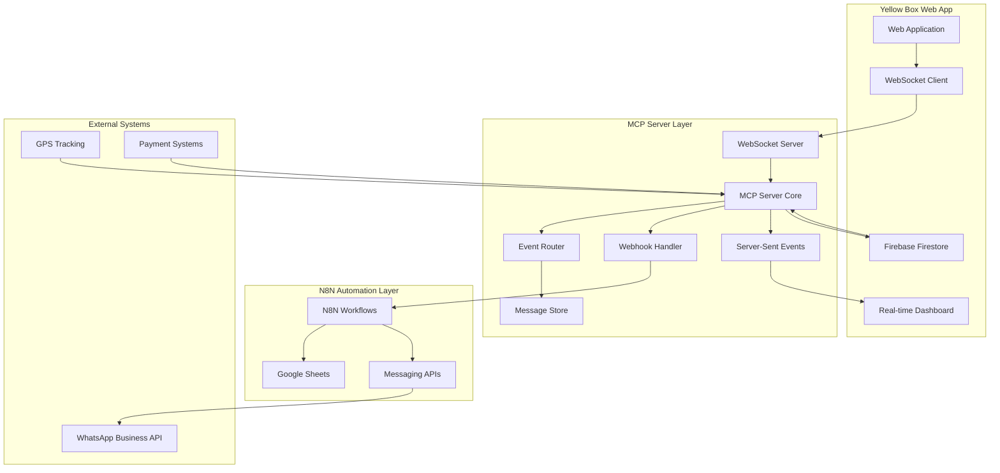

# Yellow Box MCP Server Integration Architecture & Implementation Plan

## Executive Summary

This document provides a comprehensive architecture and implementation plan for integrating a true MCP (Model Context Protocol) server into the Yellow Box fleet management system. The current system uses a basic messaging service (MCPS) via n8n webhooks, but lacks real-time bidirectional communication capabilities essential for modern fleet management.

## Current State Analysis

### Existing Infrastructure
- **MCPS Service**: One-way messaging service via n8n webhooks (WhatsApp/SMS notifications)
- **Webhook Service**: Basic webhook integration for data sync to Google Sheets
- **N8N Workflow**: Complete workflow ready for activation
- **Web App**: React-based fleet management dashboard with Firebase backend

### Critical Gap Identified
The current system lacks true **real-time bidirectional communication**. The existing "MCPS" is actually a notification service, not a Model Context Protocol server for real-time fleet monitoring.

## MCP Server Architecture Design

### 1. Core Architecture Overview



### 2. MCP Server Core Components

#### A. Real-time Event Router
```typescript
interface MCPEventRouter {
  // Route events based on type and priority
  routeEvent(event: FleetEvent): Promise<void>;
  
  // Subscribe to specific event types
  subscribe(eventType: EventType, handler: EventHandler): string;
  
  // Broadcast to multiple subscribers
  broadcast(event: FleetEvent, subscribers: string[]): Promise<void>;
}

interface FleetEvent {
  id: string;
  type: 'rider_location' | 'expense_submitted' | 'document_uploaded' | 'bike_status';
  priority: 'low' | 'medium' | 'high' | 'critical';
  payload: any;
  timestamp: Date;
  source: string;
  targetSubscribers?: string[];
}
```

#### B. Bidirectional Communication Bridge
```typescript
interface MCPCommunicationBridge {
  // WebSocket connections for real-time updates
  websocketServer: WebSocketServer;
  
  // Server-Sent Events for live dashboard updates
  sseManager: SSEManager;
  
  // HTTP endpoints for webhook integration
  httpServer: HttpServer;
  
  // Message queue for reliable delivery
  messageQueue: MessageQueue;
}

interface EventStream {
  // Stream rider location updates
  riderLocationStream: EventEmitter;
  
  // Stream expense approvals/rejections
  expenseWorkflowStream: EventEmitter;
  
  // Stream document verification status
  documentStatusStream: EventEmitter;
  
  // Stream bike tracking and maintenance
  bikeFleetStream: EventEmitter;
}
```

### 3. MCP Server Configuration Architecture

#### Primary Configuration File (`mcp-server.config.ts`)
```typescript
export interface MCPServerConfig {
  server: {
    port: number;
    host: string;
    cors: {
      origins: string[];
      credentials: boolean;
    };
  };
  
  websocket: {
    port: number;
    heartbeatInterval: number;
    reconnectTimeout: number;
  };
  
  sse: {
    endpoint: string;
    maxConnections: number;
    keepAliveInterval: number;
  };
  
  eventRouting: {
    defaultPriority: 'medium';
    retryAttempts: 3;
    batchSize: 100;
  };
  
  integrations: {
    firebase: FirebaseConfig;
    n8n: N8NConfig;
    messaging: MessagingConfig;
  };
  
  security: {
    authentication: 'firebase' | 'jwt' | 'api-key';
    rateLimiting: RateLimitConfig;
    encryption: EncryptionConfig;
  };
}
```

#### N8N Integration Configuration
```typescript
interface N8NConfig {
  webhookUrl: string;
  apiKey?: string;
  workflows: {
    riderSync: string;
    expenseProcessing: string;
    documentVerification: string;
    bikeTracking: string;
  };
  retryPolicy: {
    attempts: number;
    backoffMs: number;
  };
}
```

### 4. Real-time Notification System Design

#### Push Notification Architecture
```typescript
interface PushNotificationSystem {
  // Different delivery channels
  channels: {
    websocket: WebSocketChannel;
    sse: SSEChannel;
    webhook: WebhookChannel;
    firebase: FirebaseChannel;
  };
  
  // Notification routing
  router: NotificationRouter;
  
  // Delivery tracking
  tracker: DeliveryTracker;
}

interface NotificationRouter {
  routeByRole(notification: Notification, userRole: UserRole): Promise<void>;
  routeByLocation(notification: Notification, geofence: Geofence): Promise<void>;
  routeByUrgency(notification: Notification): Promise<void>;
}
```

#### Real-time Fleet Monitoring
```typescript
interface FleetMonitoringSystem {
  // Live rider tracking
  riderTracking: {
    activeRiders: Map<string, RiderLocation>;
    locationHistory: LocationHistory;
    geofencing: GeofenceManager;
  };
  
  // Expense monitoring
  expenseMonitoring: {
    pendingApprovals: ExpenseQueue;
    budgetAlerts: BudgetAlertSystem;
    fraudDetection: FraudDetectionSystem;
  };
  
  // Fleet health monitoring
  fleetHealth: {
    bikeStatus: Map<string, BikeStatus>;
    maintenanceAlerts: MaintenanceSystem;
    utilizationMetrics: UtilizationTracker;
  };
}
```

## Web App Integration Modifications

### A. Enhanced WebSocket Service (`src/services/mcpWebSocketService.ts`)
```typescript
export class MCPWebSocketService {
  private ws: WebSocket | null = null;
  private reconnectAttempts = 0;
  private maxReconnectAttempts = 5;
  
  connect(userId: string, userRole: string): Promise<void>;
  disconnect(): void;
  subscribe(eventType: string, callback: EventCallback): string;
  unsubscribe(subscriptionId: string): void;
  send(event: OutgoingEvent): Promise<void>;
  
  // Real-time event handlers
  onRiderLocationUpdate(callback: (location: RiderLocation) => void): string;
  onExpenseStatusChange(callback: (expense: ExpenseUpdate) => void): string;
  onDocumentVerification(callback: (document: DocumentUpdate) => void): string;
  onBikeStatusChange(callback: (bike: BikeUpdate) => void): string;
}
```

### B. Server-Sent Events Service (`src/services/mcpSSEService.ts`)
```typescript
export class MCPSSEService {
  private eventSource: EventSource | null = null;
  
  connect(endpoint: string): Promise<void>;
  disconnect(): void;
  
  // Dashboard-specific streams
  streamDashboardMetrics(callback: (metrics: DashboardMetrics) => void): void;
  streamFleetAlerts(callback: (alert: FleetAlert) => void): void;
  streamLiveMap(callback: (mapUpdate: MapUpdate) => void): void;
}
```

### C. Enhanced webhookService.ts Integration
```typescript
// Modify existing webhookService.ts to work with MCP server
export interface MCPWebhookPayload {
  operation: string; // Fixed payload format for n8n compatibility
  data: any;
  timestamp: string;
  source: 'web-app' | 'mcp-server' | 'external';
  eventId: string;
  priority: 'low' | 'medium' | 'high' | 'critical';
}

// Route through MCP server instead of direct n8n call
export const triggerMCPSync = async (
  type: string,
  id: string,
  action: string,
  data: any
): Promise<void> => {
  // Send to MCP server which handles n8n routing
  const mcpPayload = {
    operation: `${type}_${action}`,
    data: { id, ...data },
    timestamp: new Date().toISOString(),
    source: 'web-app',
    eventId: generateEventId(),
    priority: determinePriority(type, action)
  };
  
  await fetch('/api/mcp/webhook', {
    method: 'POST',
    headers: { 'Content-Type': 'application/json' },
    body: JSON.stringify(mcpPayload)
  });
};
```

## Authentication and Security Layers

### A. Firebase Authentication Integration
```typescript
interface MCPAuthSystem {
  // Firebase token validation
  validateFirebaseToken(token: string): Promise<DecodedIdToken>;
  
  // Role-based access control
  checkPermissions(userId: string, action: string, resource: string): Promise<boolean>;
  
  // WebSocket authentication
  authenticateWebSocket(handshake: any): Promise<AuthContext>;
  
  // API key management for external integrations
  validateApiKey(apiKey: string, source: string): Promise<boolean>;
}
```

### B. Rate Limiting and Security Policies
```typescript
interface SecurityPolicies {
  rateLimiting: {
    websocket: {
      connectionsPerUser: number;
      messagesPerMinute: number;
    };
    api: {
      requestsPerMinute: number;
      burstLimit: number;
    };
  };
  
  encryption: {
    websocketTLS: boolean;
    messageEncryption: boolean;
    keyRotationInterval: number;
  };
  
  monitoring: {
    suspiciousActivityDetection: boolean;
    failedAuthAttemptLimit: number;
    logLevel: 'info' | 'warn' | 'error';
  };
}
```

## Implementation Roadmap & Specific Components

### Phase 1: Foundation (Week 1-2)
1. **Setup MCP Server Infrastructure**
   - Create Node.js/TypeScript MCP server project
   - Configure WebSocket server with Socket.IO
   - Setup Server-Sent Events endpoint
   - Implement basic HTTP API

2. **Core Event System**
   - Implement EventRouter class
   - Create event queue with Redis/Firebase
   - Setup basic event types (rider, expense, document, bike)

### Phase 2: Integration (Week 3-4)
1. **N8N Workflow Integration**
   - Fix payload compatibility between web app and n8n
   - Route events through MCP server to n8n
   - Implement webhook response handling

2. **Firebase Integration**
   - Connect MCP server to Firebase Firestore
   - Setup real-time listeners for data changes
   - Implement authentication middleware

### Phase 3: Real-time Features (Week 5-6)
1. **WebSocket Implementation**
   - Rider location streaming
   - Expense status updates
   - Document verification notifications
   - Live dashboard metrics

2. **SSE Dashboard Streams**
   - Fleet monitoring dashboard
   - Real-time charts and graphs
   - Alert notifications

### Phase 4: Advanced Features (Week 7-8)
1. **Fleet Monitoring**
   - GPS tracking integration
   - Geofencing alerts
   - Bike maintenance monitoring

2. **Notification System**
   - Multi-channel delivery (WebSocket, WhatsApp, SMS)
   - Smart routing based on user role/location
   - Delivery tracking and retry logic

## API Specifications and Setup Instructions

### A. MCP Server REST API
```typescript
// Event submission endpoint
POST /api/events
{
  "type": "rider_location",
  "payload": {
    "riderId": "string",
    "latitude": number,
    "longitude": number,
    "timestamp": "ISO string"
  },
  "priority": "medium"
}

// Subscription management
POST /api/subscriptions
{
  "eventTypes": ["rider_location", "expense_submitted"],
  "userId": "string",
  "channel": "websocket" | "sse" | "webhook"
}

// Health check and status
GET /api/health
{
  "status": "healthy",
  "uptime": number,
  "connections": {
    "websocket": number,
    "sse": number
  },
  "integrations": {
    "firebase": "connected",
    "n8n": "connected"
  }
}
```

### B. WebSocket API
```typescript
// Connection authentication
{
  "type": "auth",
  "token": "firebase-auth-token",
  "userId": "string",
  "role": "admin" | "operations" | "finance" | "rider"
}

// Event subscription
{
  "type": "subscribe",
  "events": ["rider_location", "expense_submitted"],
  "filters": {
    "riderId": "specific-rider-id", // optional
    "geofence": "dubai-area" // optional
  }
}

// Event publishing (bidirectional)
{
  "type": "event",
  "eventType": "rider_location",
  "payload": { /* event data */ }
}
```

### C. Server-Sent Events Streams
```typescript
// Dashboard metrics stream
GET /sse/dashboard?token=firebase-token
// Sends: rider count, expense totals, active bikes, alerts

// Fleet tracking stream  
GET /sse/fleet?token=firebase-token
// Sends: rider locations, bike status, geofence events

// Alerts stream
GET /sse/alerts?token=firebase-token
// Sends: critical events, system alerts, maintenance notices
```

## Setup Instructions

### Development Environment
```bash
# 1. Install MCP Server
git clone <mcp-server-repo>
cd mcp-server
npm install

# 2. Configure environment variables
cp .env.example .env
# Edit .env with Firebase, N8N, and other API keys

# 3. Start MCP Server
npm run dev

# 4. Update Web App configuration
# Edit src/config/mcp.config.ts
export const MCP_CONFIG = {
  websocketUrl: 'ws://localhost:3001/ws',
  sseUrl: 'http://localhost:3001/sse',
  apiUrl: 'http://localhost:3001/api'
};

# 5. Start Web App with MCP integration
cd ../yellowbox-web-app
npm run dev
```

### Production Deployment
```bash
# 1. Deploy MCP Server to Firebase Functions or standalone server
npm run build
npm run deploy

# 2. Update N8N workflow with new MCP webhook endpoint
# 3. Update web app environment variables for production MCP server
# 4. Test end-to-end integration
```

## Key Benefits of MCP Server Integration

### Real-time Capabilities
- **Instant Updates**: WebSocket connections provide immediate data updates
- **Live Dashboard**: Real-time metrics without polling
- **Fleet Tracking**: Live GPS tracking with geofencing alerts
- **Immediate Notifications**: Instant expense approvals, document verification

### Scalability
- **Event-driven Architecture**: Efficient resource utilization
- **Message Queuing**: Reliable delivery with retry mechanisms
- **Load Balancing**: Distribute connections across multiple servers
- **Horizontal Scaling**: Add more MCP server instances as needed

### Integration Benefits
- **Seamless N8N Integration**: Maintains existing automation workflows
- **Firebase Compatibility**: Leverages existing authentication and data
- **Multi-channel Notifications**: WhatsApp, SMS, WebSocket, Email
- **Role-based Access**: Security and permissions maintained

## Monitoring and Maintenance

### Health Monitoring
```typescript
interface MCPHealthMetrics {
  serverUptime: number;
  activeWebSocketConnections: number;
  sseConnections: number;
  messageQueueSize: number;
  eventProcessingRate: number;
  errorRate: number;
  responseTime: number;
}
```

### Performance Metrics
- **Message Throughput**: Events processed per second
- **Connection Stability**: WebSocket reconnection rates
- **Latency Tracking**: End-to-end message delivery times
- **Resource Usage**: CPU, memory, network utilization

### Alerting System
- **Connection Failures**: Immediate alerts for service disruptions
- **Performance Degradation**: Alerts when metrics exceed thresholds
- **Security Events**: Failed authentication attempts, suspicious activity
- **Integration Issues**: N8N workflow failures, Firebase connection errors

## Conclusion

This comprehensive MCP server integration transforms the Yellow Box fleet management system from a basic webhook-based messaging service into a modern, real-time fleet management platform. The architecture provides:

✅ **Real-time bidirectional communication** via WebSocket and SSE  
✅ **Event streaming infrastructure** for fleet monitoring  
✅ **Message routing service** connecting web app, n8n, and external systems  
✅ **Scalable notification system** with multiple delivery channels  
✅ **Seamless integration** with existing n8n workflows  
✅ **Security and authentication** layers  
✅ **Minimal disruption** to current working components

The implementation roadmap provides a clear path to deployment while maintaining system stability and enabling advanced fleet management capabilities.